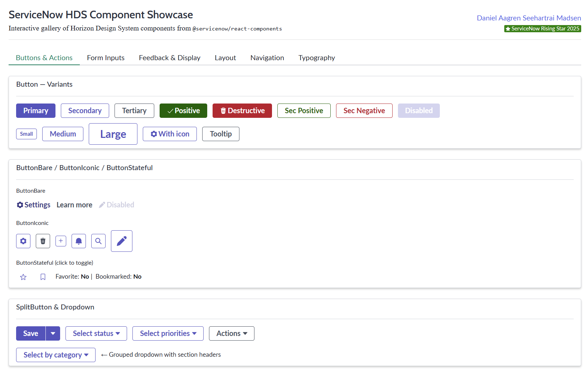

# ServiceNow HDS Component Showcase

<div align="center">
  
</div>

<div align="center">


</div>

## Overview

An interactive gallery of Horizon Design System (HDS) components from `@servicenow/react-components`, deployed as a native ServiceNow application using the [ServiceNow SDK](https://developer.servicenow.com/dev.do#!/reference/sdk). Browse, inspect, and interact with every major HDS component directly inside your ServiceNow instance — useful as a reference, a design baseline, or a starting point for your own Fluent React applications.

### Key Features

- **Full HDS Coverage** — Showcases components across 6 categories: Buttons & Actions, Form Inputs, Feedback & Display, Layout, Navigation, and Typography
- **Interactive** — Every component is live and interactive; state changes are reflected in real time
- **Native ServiceNow App** — Deployed as a scoped application using the ServiceNow SDK Fluent API, with its own navigation menu module
- **TypeScript + React 19** — Built with TypeScript and React 19, fully typed with the ServiceNow SDK types

## Components Covered

| Category | Components |
|---|---|
| **Buttons & Actions** | `Button`, `ButtonBare`, `ButtonIconic`, `ButtonStateful`, `SplitButton`, `Dropdown` |
| **Form Inputs** | `Input`, `InputUrl`, `Textarea`, `Select`, `Typeahead`, `TypeaheadMulti`, `Checkbox`, `Toggle`, `RadioButtons`, `DateTime` |
| **Feedback & Display** | `Alert`, `Badge`, `Loader`, `ProgressBar`, `Tooltip`, `Heading`, `LabelValue`, `LabelValueStacked`, `HighlightedValue`, `Avatar`, `Icon` |
| **Layout** | `Card`, `CardDivider`, `Accordion`, `AccordionItem`, `Modal`, `Collapse`, `Tabs` |
| **Navigation** | `Breadcrumbs`, `TemplateMessage` |
| **Typography** | `RichText`, `StylizedText`, `TextLink`, `Illustration`, `Image` |

## Getting Started

### Prerequisites

- Node.js >= 20.0.0
- ServiceNow SDK (`@servicenow/sdk`) installed globally
- Access to a ServiceNow instance with SDK deployment permissions

### Installation

```bash
# Clone the repository
git clone https://github.com/DanielMadsenDK/SNReactUI.git
cd SNReactUI

# Install dependencies
npm install
```

### Authenticate with your ServiceNow instance

```bash
now-sdk auth
```

### Build

```bash
npm run build
# or
now-sdk build
```

### Deploy to your instance

```bash
npm run deploy
# or
now-sdk install
```

Once deployed, navigate to **React Components Showcase → Components Showcase** in your ServiceNow instance navigation.

### Local development

```bash
npm run dev
```

## Project Structure

```
src/
├── client/           # React application (app.tsx, main.tsx)
├── fluent/           # ServiceNow Fluent metadata (UiPage, navigation)
└── server/           # Server-side TypeScript config
now.config.json       # SDK scope configuration
```

## License

This project is licensed under the MIT License — see the [LICENSE](LICENSE) file for details.

## Author

**[Daniel Aagren Seehartrai Madsen](https://www.linkedin.com/in/danielaagrenmadsen/)** — ServiceNow Rising Star 2025
